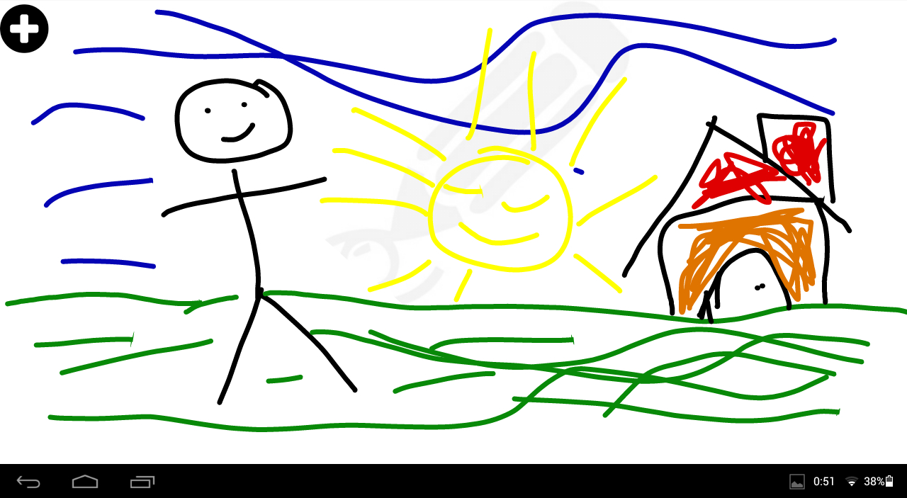
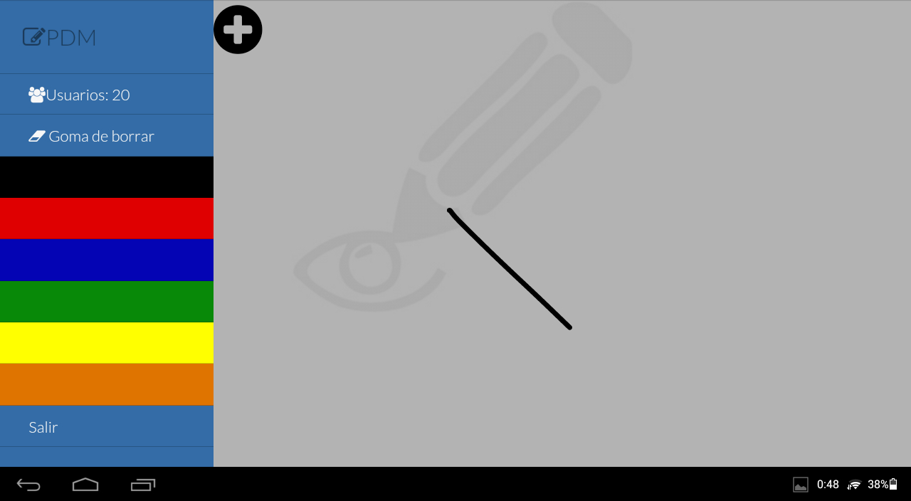
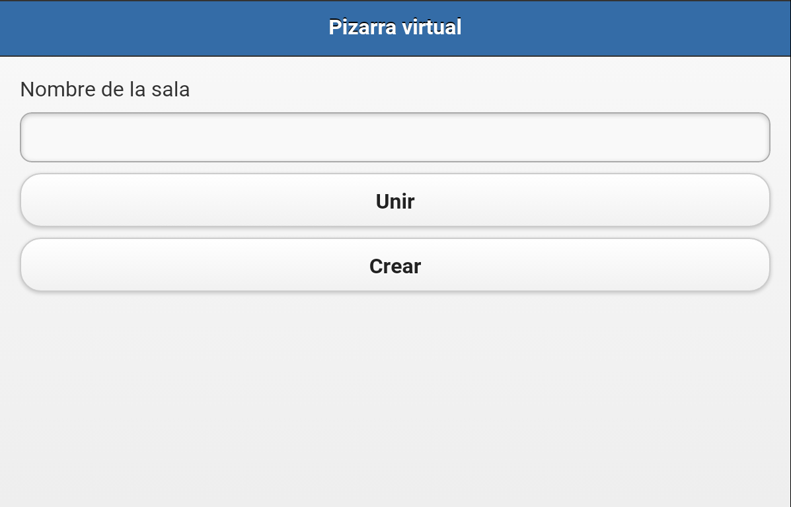

# Pizarra Virtual
Pizarra virtual para uso tanto en dispositivos móviles como en páginas web

===

### Pinta en tu dispositivo y transmítelo en tiempo real a otros dispositivos.

#### [Aplicación online](http://pizarravirtual-iblancasa.rhcloud.com/)

Utilizando:

+ [FabricJS](http://fabricjs.com/)
+ [Socket.io](http://socket.io/)
+ [NodeJS](https://nodejs.org/)
+ [ExpressJS](http://expressjs.com/)
+ [jQuery Mobile](https://jquerymobile.com/)
+ [jQuery](https://jquery.com/)
+ [MultiLevelPushMenu](http://tympanus.net/Development/MultiLevelPushMenu/)

Está pensada para ser desplegada en OpenShift.

La aplicación móvil que hay desarrollada es híbrida, siendo necesaria conexión a Internet para poder utilizarla.

Para generar la aplicación móvil, necesitarás instalar "Cordova".
[Aquí tienes más información sobre cómo hacer esto (Una vez que instales la herramientas, podrás ir a la sección "Add Platforms" y saltarte la parte de generar el proyecto. Deberás entrar a la carpeta donde se encuentra el directorio "www" entre otros)](https://cordova.apache.org/docs/en/4.0.0/guide_cli_index.md.html)
